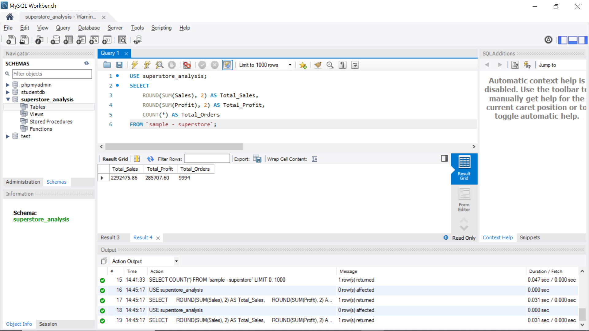
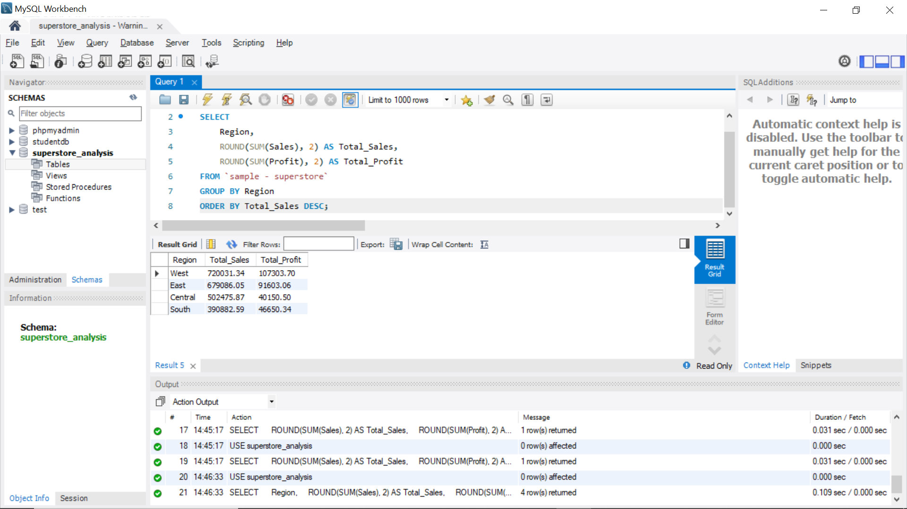
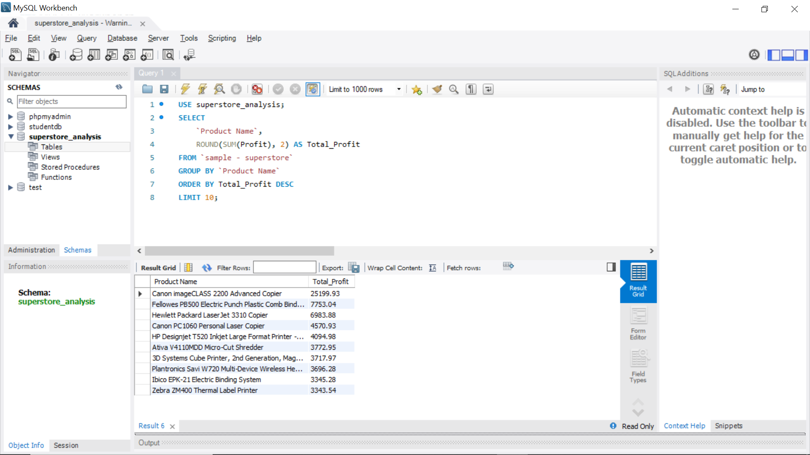
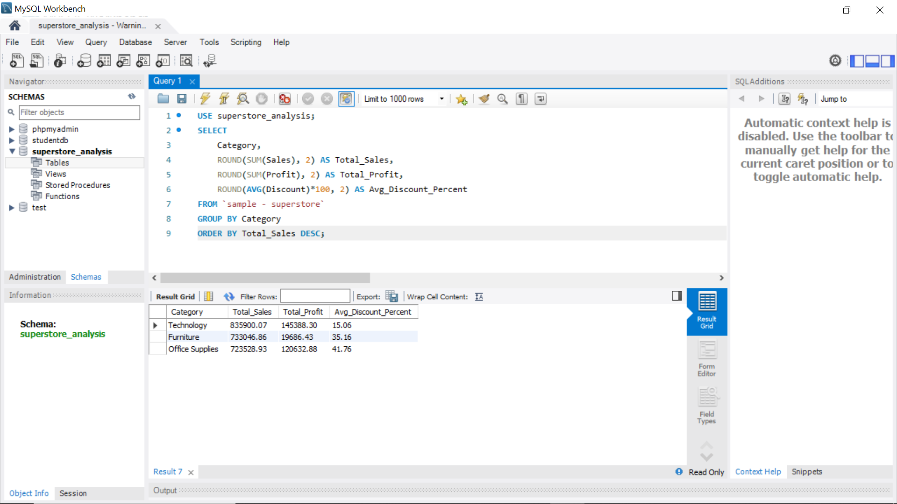
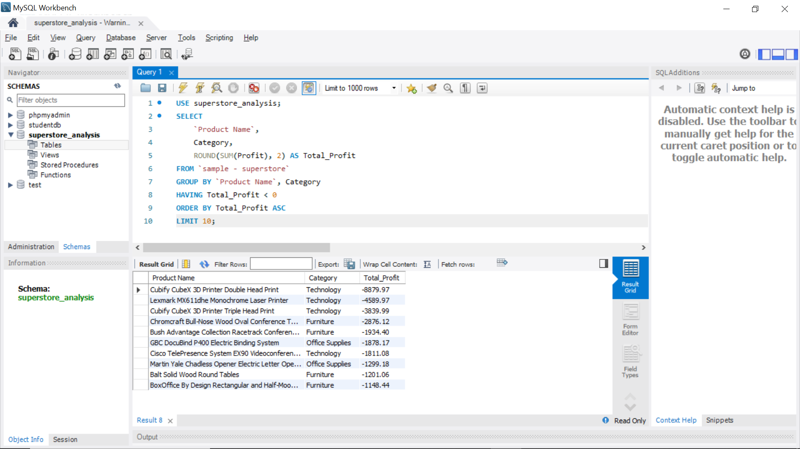
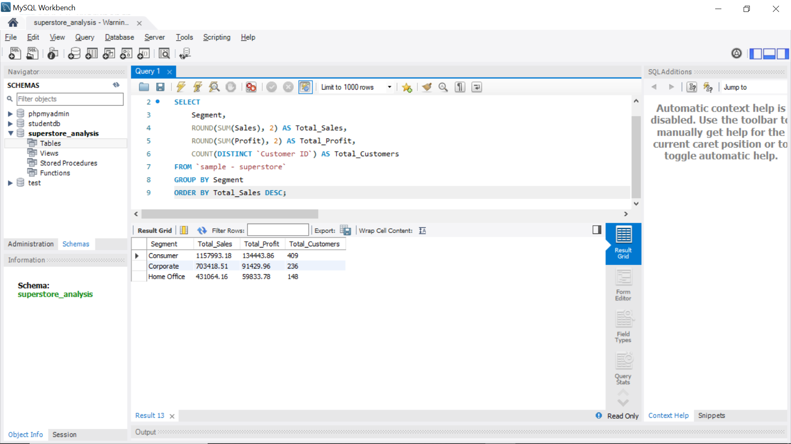
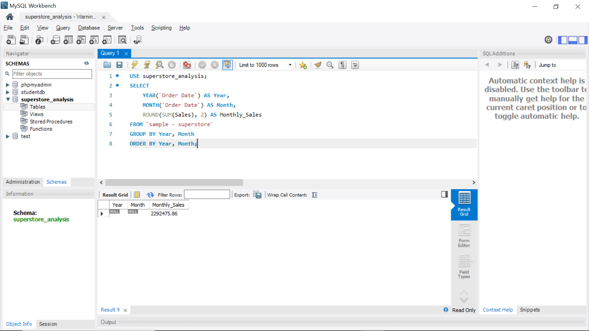
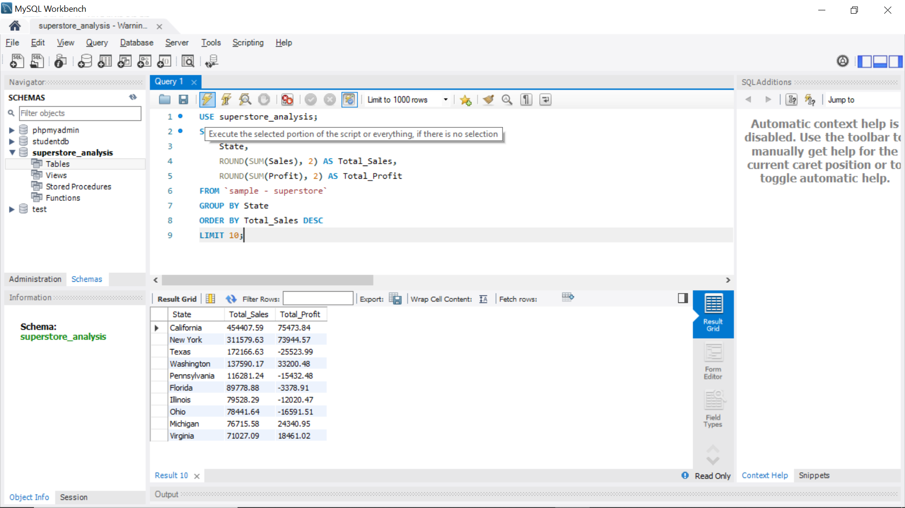
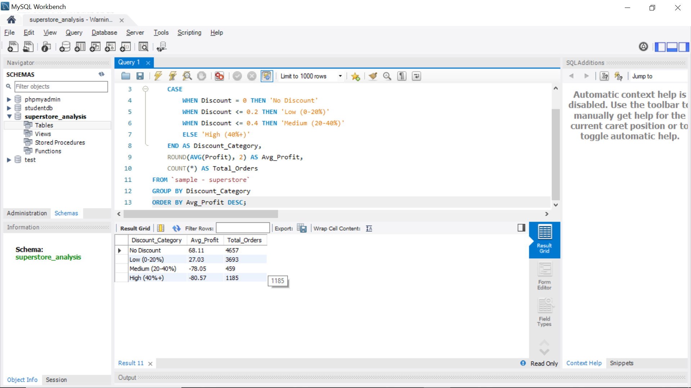
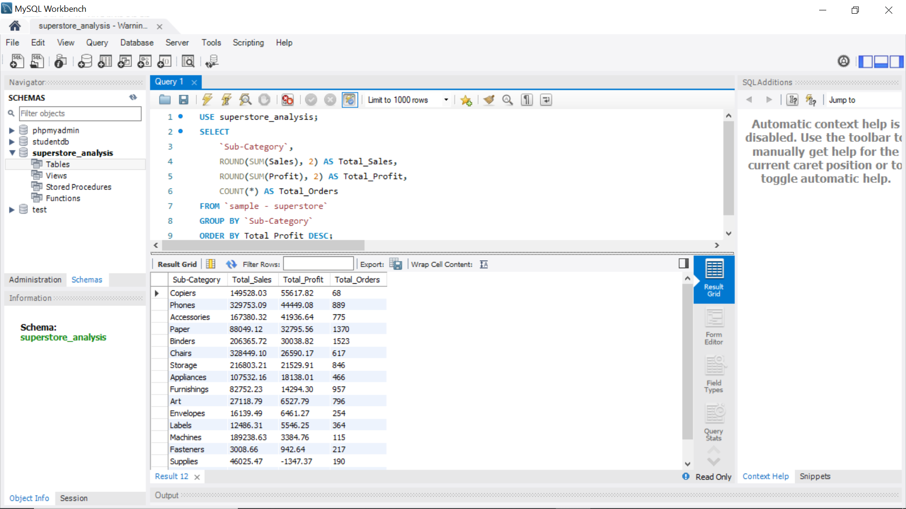

# Superstore Sales Analysis — SQL

> Advanced SQL analysis of 10,000+ retail sales records
> uncovering key business insights for strategic 
> decision making

---

## Project Overview

Performed comprehensive business analysis using MySQL
on the Superstore dataset — writing 10 advanced SQL
queries covering sales performance, profitability,
customer segments, discount impact and trend analysis.

---

## Tech Stack

| Tool | Purpose |
|---|---|
| **MySQL** | Database & query execution |
| **MySQL Workbench** | SQL IDE |
| **Dataset** | Superstore Sales (9,994 records) |

---

## Analysis Performed (10 Queries)

| # | Query | Business Question |
|---|---|---|
| 1 | Total KPIs | What are total Sales, Profit & Orders? |
| 2 | Sales by Region | Which region performs best? |
| 3 | Top 10 Products | Which products are most profitable? |
| 4 | Category Analysis | How does each category perform? |
| 5 | Loss Making Products | Which products are losing money? |
| 6 | Customer Segments | Which segment drives most revenue? |
| 7 | Monthly Trend | How have sales grown over time? |
| 8 | Top States | Which states have highest sales? |
| 9 | Discount Impact | How do discounts affect profit? |
| 10 | Sub-Category | Which sub-categories are most profitable? |

---

## Query Results

### Query 1 — Total Sales, Profit & Orders


### Query 2 — Sales by Region


### Query 3 — Top 10 Most Profitable Products


### Query 4 — Sales by Category


### Query 5 — Loss Making Products


### Query 6 — Customer Segments


### Query 7 — Monthly Sales Trend


### Query 8 — Top 10 States by Sales


### Query 9 — Discount Impact on Profit


### Query 10 — Sub-Category Performance


---

## Key Business Insights

| Insight | Finding | Business Action |
|---|---|---|
| **Best Region** | West leads with highest sales | Expand operations |
| **Best Category** | Technology = highest profit | Increase inventory |
| **Discount Impact** | High discount = negative profit | Revise discount policy |
| **Loss Products** | Tables & Bookcases losing money | Review pricing |
| **Top Segment** | Consumer segment = 50%+ revenue | Focus marketing here |

---

## SQL Concepts Used

GROUP BY & ORDER BY  
Aggregate Functions (SUM, AVG, COUNT)  
HAVING Clause  
CASE WHEN Statements  
LIMIT & Filtering  
Date Functions (YEAR, MONTH)  
Subqueries  
Aliases  

---

## How to Run

### 1. Import dataset
```sql
CREATE DATABASE superstore_analysis;
USE superstore_analysis;
-- Import Sample-Superstore.csv via Table Import Wizard
```

### 2. Run queries
```sql
-- Open superstore_sql_analysis.sql
-- Run each query in MySQL Workbench
```

---

## Author
**Nensi Dobariya** — Business Analyst | Data Analyst  
nensidobariya3112@gmail.com
[LinkedIn](https://www.linkedin.com/in/nensi-dobariya)  
[GitHub](https://github.com/Nensidobariya)
